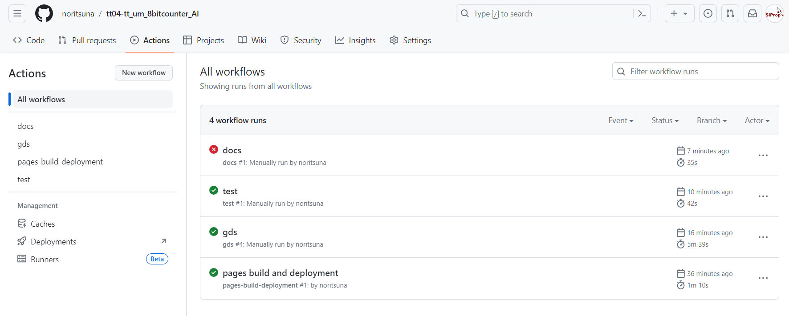
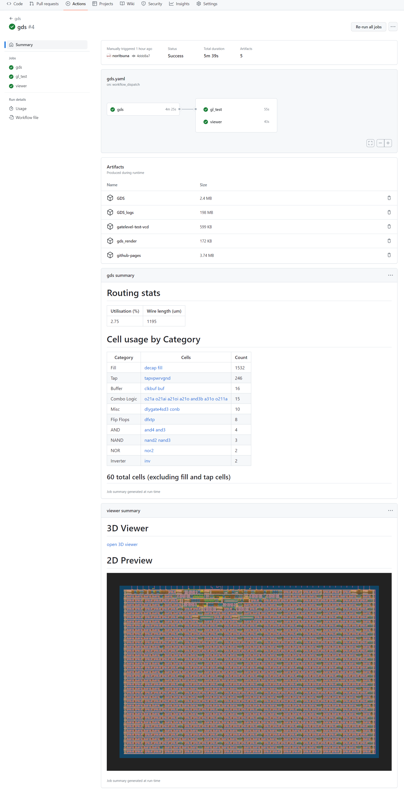
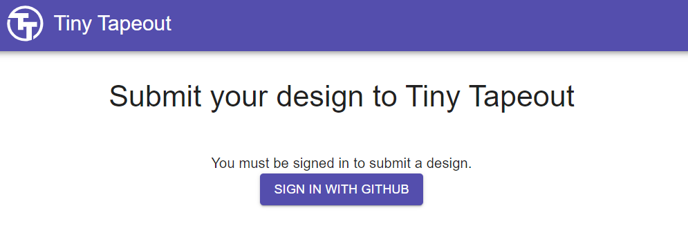
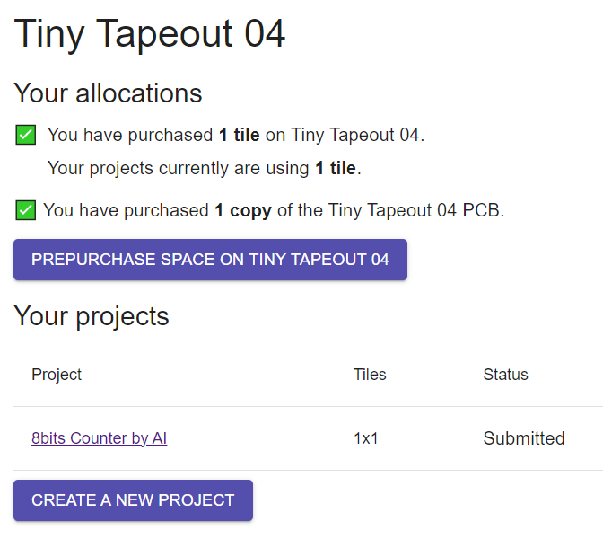
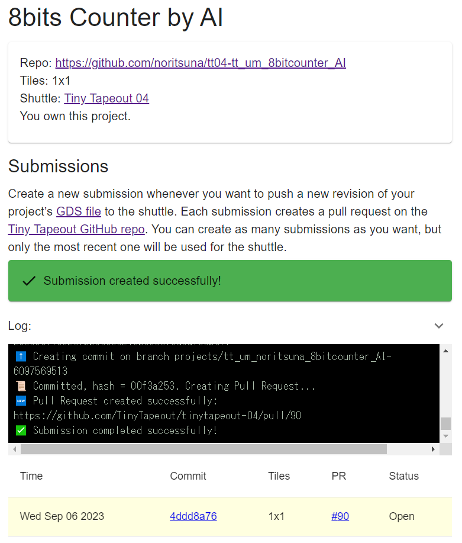
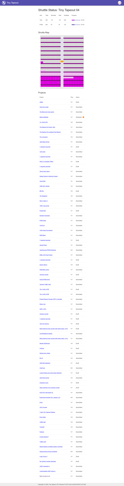

  

# 何のプロジェクト？
[TinyTapeout](https://tinytapeout.com)というサービスを利用してみたという体験記的なプロジェクトです。  
ちなみに、[TinyTapeout](https://tinytapeout.com)の4回目を利用しました。

## [TinyTapeout](https://tinytapeout.com)とは？
約100万円で半導体チップが作れる[ChipIgnite](https://efabless.com/)というサービスがあるのですが、そのユーザエリア（回路を記述するエリア）：10mm x 10mmをみんなでシェアすることで1エリア約1万円で半導体チップが作れるというサービスです。  
当然、1エリアは非常に小さくなるので、7セグコントローラくらいのサイズの回路しかできませんが、初心者が始めて半導体チップ製造を体験するには非常に良いサービスなのです。  

# 何を作ったの？
LLaMa2をPC上で動作させて、自動生成させたVerilogの8bitカウンターです。  
なぜ、自動生成なのか？は、[Edge_Circuit_Designer](https://github.com/noritsuna/Edge_Circuit_Designer) をご覧ください。

## 使ったプロンプト
- Prompt
```
Please generate a 8 bits counter in verilog with the following conditions. The argument to be used are input wire [7:0] ui_in, output wire [7:0] uo_out, input  wire [7:0] uio_in, output wire [7:0] uio_out, output wire [7:0] uio_oe, input wire ena, input wire clk, input wire rst_n. The counter variable shall be reg [7:0] count. reg [7:0] count is assign to output wire [7:0] uo_out. The input should only be count. The output should only be count. Count up the count variable by increasing the count variable by 1. The module name is tt_um_noritsuna_8bitcounter_AI.
```

# [TinyTapeout](https://tinytapeout.com)へ投稿するには？
## Verilogソースを書く
[https://github.com/TinyTapeout/tt04-verilog-demo](https://github.com/TinyTapeout/tt04-verilog-demo)をforkします。  
作りたい機能のVerilogのファイルを作ります。そもそも大きな回路は作れませんので、サンプルを見ながら作れば、問題ないと思います。  
また、cocotbによるテストベンチを書くこともできますが、作らなくても投稿は可能です。

### トラブルポイント
- モジュール名には、「tt_um_」というプリフィックスが必要
    - ファイル名などを同じようにプリフィックスが必要

## GDSファイルを作る
GDSファイルが提出するファイルとなります。  
生成方法は、forkして作ったプロジェクト（Verilogファイル）をコミットして、Github Actionでビルドします。  
Github Actionで、GDSをクリックするだけです。



GDSが正常に生成されると下記のような画面が表示されます。



### トラブルポイント
- Github PagesをGithub Actionモードで有効にする。リポジトリのSettings内のPagesの「Build and deployment」を、デフォルトの”Deploy from a branch"から"GitHub Actions"に変更する。

## [TinyTapeout](https://tinytapeout.com)へ投稿する
[TinyTapeout](https://tinytapeout.com)にMyPageを作ります。  
[こちら](https://app.tinytapeout.com/projects/create)から作成できるので、作成します。  


作成時にリンクさせるGithubのURLを入力する欄がありますので、そこの入れればOKです。  
その後、入金画面になりますので、必要な支払いをします。  


入金が完了すると、submit可能となりますので、submitボタンを押すとGDSが登録されます。  


成功すれば、このように配置されます。あとは、到着を待つだけです！  

